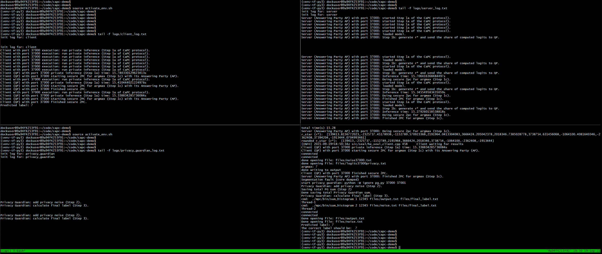

# CaPC

Confidential and Private Collaborative Machine Learning

We develop a protocol involving a small number of parties (e.g., a few
hospitals) who want to improve the utility of their respective models via
collaboration, and a third party Privacy Guardian (PG). Each party first
trains its own model on its local dataset. The PG generates a pair of secret and
public keys for an additive homomorphic encryption scheme and sends the public
key to all collaborating parties. Once a party identifies a query they would
like a label for, they initiate the collaboration protocol.

## Docker for CaPC

Please install docker from: https://www.docker.com/

We packed the CaPC code to a single docker container. You should be able to download the container from the docker hub: 
```docker pull adziedzi/capc:version4```

Then run the container: 
```docker run -it adziedzi/capc:version4```

You can skip directly to Method 1 (Tmux and Terminal) below to run the CaPC demo.

To run jupyter notebook from the container, execute the following command:

```docker run -it -p 8888:8888 adziedzi/capc:version4```

### Run the CaPC protocol from a file:

Go go: `~/code/capc-privacy`

Set the environment: `source activate_env.sh`

Run the protocl: `python run_protocol.py`

Example of the expected output:
```
(venv-tf-py3) (base) dockuser@nic2:~/code/capc-privacy$ python run_protocol.py
delete file: files/logits37000privacy.txt
delete file: files/output37000.txt
delete file: files/noise37000.txt
delete file: files/inference_times
delete file: files/argmax_times
delete file: files/inference_no_network_times
port: 37000
Start the servers (answering parties: APs).
Start the client (the querying party: QP).
Server (Answering Party AP) with port 37000: started Step 1a of the CaPC protocol).
correct_label: 7
Client with port 37000 execution: run private inference (Step 1a of CaPC protocol).
Client with port 37000 execution: run private inference (Step 1a of CaPC protocol).
Querying party: run inference (Step 1a)
Connecting to server...
Server (Answering Party AP) with port 37000: loaded model.
Accept a query from a client.
query shape before processing: (1, 1, 28, 28)
Answering party: run private inference (Step 1a)
Server (Answering Party AP) with port 37000: Step 1b: generate r* and send the share of computed logits to QP.
rstar: [ 2855118.62623207  4045716.16136521  -218770.92183034   571129.305587
   579289.06708932  3915945.84900325   381013.50652904  -214076.69116168
 -2519898.47359065   191199.71596776]
y_hat: [[-28.335892 -21.18571  -24.084558 -16.783772 -26.487919 -27.690502
  -33.778145   0.       -27.280285 -16.880634]]
Server (Answering Party AP) with port 37000: Inference time: 0.005423784255981445s
total time(s) 0.006
Server (Answering Party AP) with port 37000: Doing secure 2pc for argmax (Step 1c).
Client (QP) with port 37000 private inference (Step 1a) time: 3.040104389190674s
r_star (r*):  [2855118.62623207,4045716.16136521,-218770.92183034215,571129.3055869956,579289.067089323,3915945.8490032507,381013.5065290425,-214076.6911616847,-2519898.47359065,191199.71596775856]
Client (QP) with port 37000 private inference (Step 1a) time: 3.040104389190674s
rounded r_star (r*):  [2855118,4045716,-218770,571129,579289,3915945,381013,-214076,-2519898,191199]
Client (QP) with port 37000 starting secure 2PC for argmax (Step 1c) with its Answering Party (AP).
Client (QP) with port 37000 starting secure 2PC for argmax (Step 1c) with its Answering Party (AP).
connected
connected
done opening file: files/logits37000privacy.txt
done opening file: files/noise37000.txt
argmax: 7
done writing to output
Client (QP) with port 37000 finished secure 2PC.
Client (QP) with port 37000 finished secure 2PC.
Server (Answering Party AP) with port 37000: finished 2PC for argmax (Step 1c).
step 1a runtime: 3.1125810146331787s
start privacy guardian: python -W ignore pg.py --start_port 37000 --end_port 37001 --log_timing_file logs/log-timing-2021-11-05-10-06-11-961774.log --dp_noise_scale 0.1
Privacy Guardian: add privacy noise (Step 2).
Saving total PG sum (Step 2)
Done saving total Privacy Guardian sum (DP noise scale: 0.1).
Privacy Guardian: calculate final label (Step 3).
cmd:  ./mpc/bin/sum_histogram 1 12345 files/output.txt files/final_label.txt
Thread-1
cmd:  ./mpc/bin/sum_histogram 2 12345 files/noise.txt files/final_label.txt
Thread-2
connected
connected
Done opening file: files/noise.txt
Done opening file: files/output.txt
Predicted label: 7
```

### jupyter notebook

If your HE-transformer works go to: `~/code/capc-demo`, otherwise navigate to: `~/code/capc-privacy` and run:

```source activate_env.sh```

You should see the command propmt starting from: `(venv-tf-py3) dockuser@ ...`.

Check if the python environment `venv-tf-py3` was registered for jupyter kernels:

```pip install ipykernel```

```python -m ipykernel install --name=venv-tf-py3```

Run jupyter notebook:

```jupyter notebook --ip 0.0.0.0 --no-browser --allow-root```

In the obtained link, replace `0.0.0.0` with `localhost`. Copy the link to your local browser (outside of the container).

Change the kernel in jupyter notebook in the top menu: `Kernel -> Change kernel -> venv-tf-py3`.

## he-transformer 
The code is based on the he-transformer library.

Install he_transformer from here: https://github.com/IntelAI/he-transformer. We
use the ubuntu 18.04 version.

We packed the he-transformer to a single docker container. You should be able to download he-transformer from docker hub with version3: 
```docker pull adziedzi/he-transformer:version3```

Then run the container: 
```docker run -it adziedzi/he-transformer:version3```

Go to the container. Run: 
```source ~./profile```

Next, we check if he-transformer was installed correctly.

Run tmux: 
```tmux new -s he-transformer```

Create two panes `Ctrl+b` and `Shift+"` and then execute [a simple example from he-transformer library](https://github.com/IntelAI/he-transformer/tree/master/examples#client-server-model).

For a simple demonstration of a server-client approach, run the server in the first pane:
```
python $HE_TRANSFORMER/examples/ax.py \
  --backend=HE_SEAL \
  --enable_client=yes \
  --port 35000
```

and client in the other pane:
```
python $HE_TRANSFORMER/examples/pyclient.py --port 35000
```

If the above works, then clone our repository from: https://github.com/cleverhans-lab/capc-demo and follow these instructions below.

`~/code$ git clone https://github.com/cleverhans-lab/capc-demo.git`

## CaPC Demo
Install the crypto packages.

```
wget https://raw.githubusercontent.com/emp-toolkit/emp-readme/master/scripts/install.py
python install.py -install -tool -ot -sh2pc
```

Then, make the cpp code:

```
cd mpc 
cmake .
make
```

Make sure libtmux is installed.

Train a cryptonets-relu.pb model and store it in `~/models/cryptonets-relu.pb`.

To run the protocol, follow method 1 (recommended), method 2 or method 3 as described below.

### Method 1 (Tmux and Terminal) 

One way to use the terminal is to use PyCharm and opening a SSH terminal there.
To do so, first create a configuration for a remote interpreter based on your
machine IP address and account. Then go to `Tools>Start SSH Session` to select the
host. The remote terminal will then automatically open.

To run the pipeline, run `tmux new -s capc` to open a new tmux session. Create 4
panes by first doing Ctrl+b followed by " to create two horizontally split panes and then Ctrl+b
followed by % to create the second and third panes, then do Ctrl+b and up-arrow, 
followed by Ctrl+b and % to create panes 0 and 3. The orientation of the panes will now be:

```
---0---|---1---
---2---|---3---
```

You can see the pane numbers by doing Ctrl+b and pressing q.

To switch between panes, use Ctrl+b and then the relevant arrow key
corresponding to the direction of the pane to switch to. For example to switch
from pane 1 to pane 2, use Ctrl+b followed by the right arrow key. To scroll up through the output of a pane, use Ctrl+b followed by the left square bracket. To type in the terminal again, press 'q'. 


To activate the python environment and the HE transformer library, in each of the panes, go to the directory where the experiment files are
located: `cd ~/code/capc-demo` and run `source activate_env.sh`. 

This does:
```
cd ~/code/he-transformer
export HE_TRANSFORMER=$(pwd)
source ${HE_TRANSFORMER}/build/external/venv-tf-py3/bin/activate
```

Special case if you are on our nic2 machine:

```
cd /home/dockuser/code/he-transformer
export HE_TRANSFORMER=$(pwd)
source ${HE_TRANSFORMER}/build/external/venv-tf-py3/bin/activate
```

Do `Ctrl+b q` to show number of panes. In pane 2, run `python init_log_files.py` to initialize the log files.

Go to pane 0 and let it show logs from `client.py`, run `tail -f logs/client_log.txt`
while pane 1 shows logs from the `server.py`, run in pane 1: `tail -f logs/server_log.txt`.
Pane 2 shows logs from the whole execution in `run_protocol.py` and 
the Privacy Guardian shows logs in pane 3, run in pane 3: `tail -f logs/privacy_guardian_log.txt`. 

Finally, go to pane 2, replace `X` in the code below with the number of answering parties. Not including n_parties will
lead to 1 party by default and run the main script:
```
python init_log_files.py
python run_protocol.py --n_parties X
```

Server and client complete Step 1 of the protocol including secure 2 party communication.
By default, the query will be the first item from the mnist test set. To change this, 
add the parameter `--start_batch Y` when running the experiment where Y is the index of
the test set to use. 

After Step 1, we run pg.py which consists of steps 2 and 3 of the protocol. Here the PG (Privacy Guardian) sums the `s` vectors (shares) and adds the Gaussian noise for DP (Step 2). Next, PG and the querying party run Yao's garbled circuit to obtain the final label (Step 3) which will also be outputted in Pane 1.


### Method 2 (Terminal)

Use a remote terminal to connect to the lab machine. Go to`cd ~/code/capc-demo` 
and activate the environment and HE-transformer library by running `source activate_env.sh`. Next run  

```
python run_protocol.py --n_parties X
```

Replace X with the number of answering parties. Not including n_parties will lead to 1 party by 
default. By default, the query used will be the first item from the mnist test set. To change this, add
the parameter `--start_batch Y` when running the script where Y is the index of the test set to use.

The program will automatically run the files `server.py` and `client.py` to complete step 1 of the CaPC protocol. After this it calls the privacy guardian
through the file `pg.py` to complete steps 2 and 3 of the protocol. 


### Method 3 (Jupyter Notebook)

Using SSH, log in to the lab machine and go to the directory ~/code/demo/capc.
Run the activate script to activate the Python environment and the HE
transformer library. Then start a jupyter notebook session with the command

```
On nic2: (venv-tf-py3) dockuser@nic2:~/code/demo/capc$ jupyter notebook
--no-browser --port=8080
```

Now create two ssh tunnels with the following commands to access the jupyter
notebook from your local pc.

```
a) ssh -f -N -L 127.0.0.1:3320:10.6.10.132:22 username@q.vectorinstitute.ai;

b) ssh -f -N -L 8080:localhost:8080 dockuser@127.0.0.1 -p 3320
```

Use `localhost:8080` to open the Jupyter server on your local browser. Enter the
token provided when the notebook session was initially set up.

To run the experiment, open the notebook run_experiment.ipynb and start by
setting the number of parties at the start of the notebook and the index of the
mnist test set to use as the query item. 

Run the cells to start the protocol. After the initial imports and setup required, 
one cell will run step 1 by calling `server.py` and `client.py` and the next will then run steps 2 and 3 
by calling `pg.py`. The final predicted label as well as the actual label will be outputted by the last cell
of the notebook. 


### Outputs

The output files produced by the program will be saved in the folder "files" and
the logs will be saved in the folder "logs" with the appropriate timestamp.

Note that sometimes, the predicted label can be different than expected one. It can be due to the added noise for privacy or a misclassification of an example.

  {#fig:capc-demo-example}
